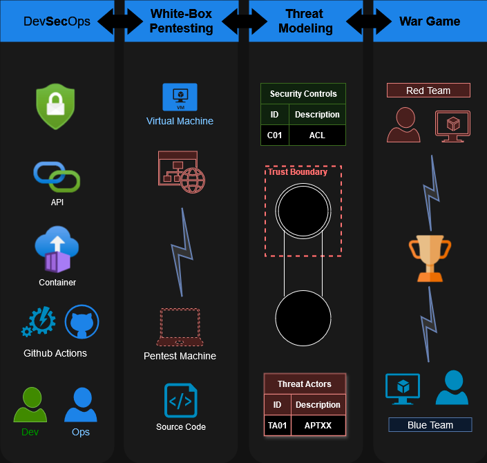

<p align="center">
    
</p>

[](https://www.gnu.org/licenses/gpl-3.0)


## ⚠️ Disclaimer

This repository, together with its tools, is provided by Taisen-Solutions on an “as is” basis. Be aware that this application is highly vulnerable, including remote command and code execution. Use it at your own risk.
Taisen-Solutions makes no representations or warranties of any kind, express or implied, as to the operation of the information, content, materials, tools, services and/or products included on the repository. Taisen-Solution disclaims, to the full extent permissible by applicable law, all warranties, express or implied, including but not limited to, implied warranties of merchantability and fitness for a particular purpose.


## 🎱 Use Case




## 🐞 Vulnerabilities

| CWE | Description | Difficulty | Hint | Estimated Reward in Bug Bounty |
|----|---|----|---|----|
| CWE-22 | Path Traversal | Medium | filter bypass | 500-5.000$ |
| CWE-78 | OS Command Injection | Easy | Get username | 1.000-10.000$|
| CWE-79 | Cross-site Scripting | Easy | Pop the logs readers | 500-5.000$ |
| CWE-89 | SQL Injection | Easy | Login without creds | 1.000-10.000$ |
| CWE-94 | Code Injection| Hard | Write in server console | 5.000-50.000$ |
| CWE-91 | XML Injection | Hard | Use Transform | 0-500$ |
| CWE-98 | Remote File Inclusion | Hard | Find the good protocol | 1.000-10.000$ |
| CWE-184 | Incomplete List of Disallowed Inputs | Hard | Not so NoSQL | 1.000-10.000$|
| CWE-213 | Exposure of Sensitive Information Due to Incompatible Policies | Easy | RTFM | 500-2.000$ |
| CWE-284 | Improper Access Control | Medium | Bring your own token | 1.000-5.000$ |
| CWE-287 | Improper Authentication | Medium | Go ahead | 500-5.000$ |
| CWE-319 | Cleartext Transmission of Sensitive Information | Very Easy | Sniff | 500-2.000$ |
| CWE-326 | Inadequate Encryption Strength | Easy | Code review | 1.000-5.000$ |
| CWE-434 | Unrestricted Upload of File with Dangerous Type | Medium | What can go wrong ? | 500-10.000$ |
| CWE-502 | Deserialization of Untrusted Data | Hard | Change the readOnly permission | 5.000-50.000$ |
| CWE-521 | Weak Password Requirements | Very Easy | Null | 500-2.000$ |
| CWE-532 | Insertion of Sensitive Information into Log File | Very Easy | Nothing to hide |100-2.000$ |
| CWE 639 | Insecure Direct Object Reference | Medium | Enumeration is key |500-5.000$ |
| CWE-611 | Improper Restriction of XML External Entity Reference | Hard | Read the Windows.ini | 1.000-10.000$ |
| CWE-787 | Out-of-bounds Write | Easy | Read Memory | 500-5000$ |
| CWE-798 | Use of Hard-coded Credentials | Very Easy | Code review | 1.000-10.000$ |
| CWE-829 | Local File Inclusion | Easy | Insert content | 500-2.000$|
| CWE-918 | Server-Side Request Forgery (SSRF) | Medium | choose your domain | 1.000$-10.000$|
| CWE-1270 | Generation of Incorrect Security Tokens | Medium | Code review | 1.000-20.000$ |
| CWE-1395 | Dependency on Vulnerable Third-Party Component | Easy | Old stuff discovery | 0-500$ |

## 🔑 Write Up

Become a project sponsor and gain access to all the solutions.

## 🏭 Context

VLA is designed as a vulnerable backend application, running in the following environment : 


Be aware that VLA is works on Linux and MacOS But is only tested and supported on Windows.


## ✅ Prerequisites

Check `.csproj` file to get the current dotnet version and install [.NET SDK](https://dotnet.microsoft.com/en-us/download)

## ⬇️ Download

```PowerShell
git clone https://github.com/Aif4thah/VulnerableLightApp.git
cd .\VulnerableLightApp\
```

## 🔧 Build

```PowerShell
dotnet build
```

## 🎮 Usage

```PowerShell
.\bin\Debug\net8.0\VulnerableWebApplication.exe [--url=<url>]
```

Alternatively, you can run directly with

```PowerShell
dotnet run
```


## 🛠️ Debug 

### Dotnet Framework

Verify you use the intended .NET Framework

```cmd
where dotnet
dotnet --version
dotnet --list-sdks
```


### Certificates

To trust the certificate

```PowerShell
dotnet dev-certs https --trust
```


### Dependancies

dependancies have to be dowloaded from [standard sources](https://go.microsoft.com/fwlink/?linkid=848054)

```sh
dotnet nuget add source "https://api.nuget.org/v3/index.json" --name "Microsoft"
```


## 💜 Crédits

* Project maintened by [Michael Vacarella](https://github.com/Aif4thah)
* Thanks to the first 100 students who contributed to the maturity of this project