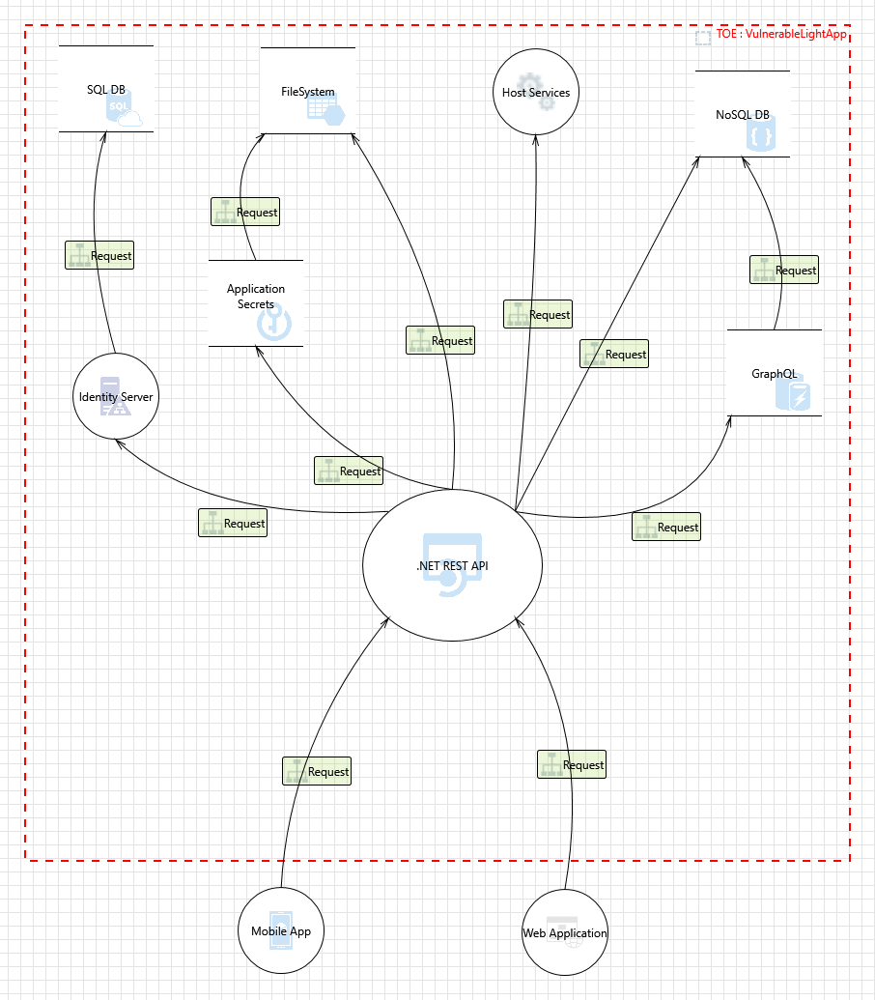
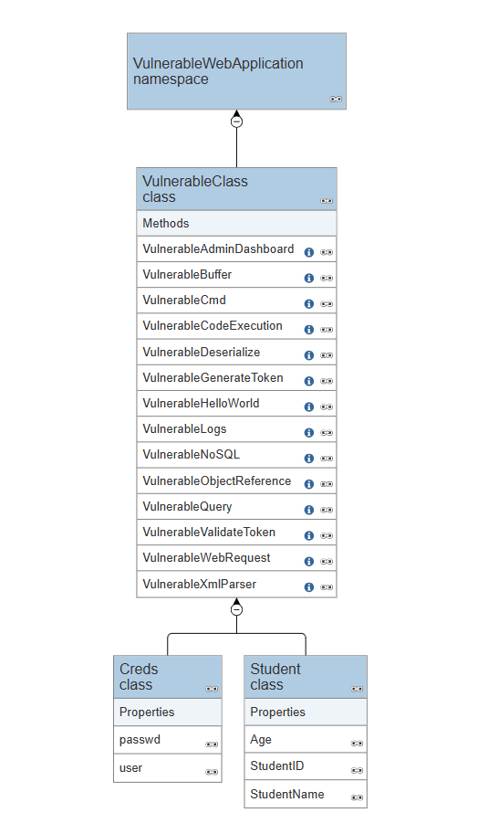

# Vulnerable Web Apps

[](https://www.gnu.org/licenses/gpl-3.0)
[](https://github.com/Aif4thah/Dojo-101/pulls)
[](https://etherscan.io/address/0xcC424e30Ff6eEAb4E6B3A900c5446038F858b314)
[](https://www.buymeacoffee.com/taisensolutions)

Vulnerable API for educational purposes

## Disclaimer

This repository, together with its tools, is provided by Taisen-Solutions on an “as is” basis. Taisen-Solutions makes no representations or warranties of any kind, express or implied, as to the operation of the information, content, materials, tools, services and/or products included on the repository. Taisen-Solution disclaims, to the full extent permissible by applicable law, all warranties, express or implied, including but not limited to, implied warranties of merchantability and fitness for a particular purpose.

## Contact

If you have any questions about this project feel free to reach out :

 [](https://taisen.fr)
 [](https://www.linkedin.com/in/mvacarella/)
 [](mailto:michael.vacarella@protonmail.com)

## Context

VLA is designed as a vulnerable backend application, running in the following environment : 

!

## Vulnerabilities

| CWE | Description | Difficulty | Hint | Estimated Reward in real Bug Bounty |
|----|---|----|---|----|
| CWE-23 | Relative Path Traversal | Medium | Bypass the filter | 500-5.000$ |
| CWE-78 | Improper Neutralization of Special Elements used in an OS Command ('OS Command Injection') | Easy | Get the user | 1.000-10.000$|
| CWE-79 | Improper Neutralization of Input During Web Page Generation ('Cross-site Scripting') | Easy | Pop the admin | 500-5.000$ |
| CWE-89 | Improper Neutralization of Special Elements used in an SQL Command ('SQL Injection') | Easy | Login without creds | 1.000-10.000$ |
| CWE-94 | Improper Control of Generation of Code ('Code Injection') | Hard | Write in server console | 5.000-50.000$ |
| CWE-213 | Exposure of Sensitive Information Due to Incompatible Policies | Very Easy | Read the docs | 500-2.000$ |
| CWE-284 | Improper Access Control | Medium | Bring your own token | 1.000-5.000$ |
| CWE-287 | Improper Authentication | Medium | go ahead | 500-5.000$ |
| CWE-319 | Cleartext Transmission of Sensitive Information | Very Easy | Sniff | 500-2.000$ |
| CWE-326 | Inadequate Encryption Strength | Easy | Code review | 1.000-5.000$ |
| CWE-434 | Unrestricted Upload of File with Dangerous Type | Easy | What can go wrong ? | 500-2.000$ |
| CWE-502 | Deserialization of Untrusted Data | Hard | Change NTFS permission | 5.000-50.000$ |
| CWE-521 | Weak Password Requirements | Very Easy | null | 500-2.000$ |
| CWE-532 | Insertion of Sensitive Information into Log File | Very Easy | Nothing to hide|100-2.000$ |
| CWE 639 | Insecure Direct Object Reference | Medium | Enumeration is key |500-5.000$ |
| CWE-611 | Improper Restriction of XML External Entity Reference | Hard | Windows.ini | 1.000-10.000$ |
| CWE-787 | Out-of-bounds Write | Easy | Don't crash the service | 500-5000$ |
| CWE-798 | Use of Hard-coded Credentials | Very Easy | Code review | 1.000-10.000$ |
| CWE-829 | Inclusion of Functionality from Untrusted Control Sphere (Local file Inclusion) | Medium | Read | 500-2.000$|
| CWE-918 | Server-Side Request Forgery (SSRF) | Medium | choose your domain | 1.000$-10.000$|
| CWE-1104 | Use of Unmaintained Third Party Components | Easy | old stuff | 500-1.000$|
| CWE-1270 | Generation of Incorrect Security Tokens | Medium | Code review | 1.000-20.000$ |

## Classes Diagram



## install

Check `.csproj` file to get the current dotnet version

### windows

https://dotnet.microsoft.com/en-us/download

### Linux - not supported

```sh
sudo apt-get update -y 
sudo apt purge -y dotnet-sdk-8.0 aspnetcore-runtime-8.0 dotnet-runtime-8.0
sudo apt autoremove -y
wget "https://packages.microsoft.com/config/ubuntu/$(lsb_release -rs)/packages-microsoft-prod.deb" -O packages-microsoft-prod.deb
chmod +x packages-microsoft-prod.deb
sudo dpkg -i packages-microsoft-prod.deb
sudo apt install dotnet-sdk-8.0 -y
```

## run

```sh
dotnet run
```

## Debug 

### Certificates

To trust the certificate (Windows and macOS only) run 

```PowerShell
dotnet dev-certs https --trust
```

### Dependancies

dependancies are dowloaded from [standard sources](https://go.microsoft.com/fwlink/?linkid=848054)

```sh
dotnet nuget add source "https://api.nuget.org/v3/index.json" --name "Microsoft"
```