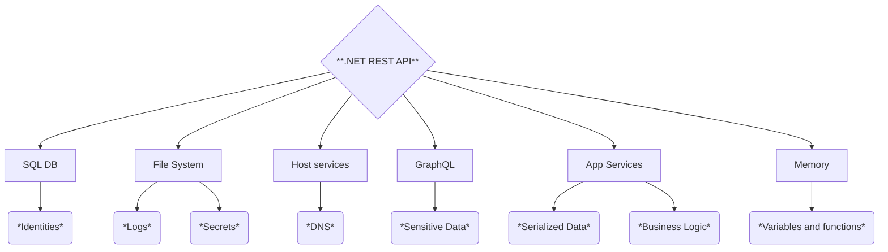

<p align="center">
    
</p>

[](https://www.gnu.org/licenses/gpl-3.0)

[](https://github.com/Aif4thah/VulnerableLightApp/actions/workflows/dotnet.yml)
[](https://github.com/Aif4thah/VulnerableLightApp/actions/workflows/docker.yml)
[](https://github.com/sponsors/Aif4thah/)


> [!WARNING]
> This repository and its tools are provided "as is" without warranty of any kind, either express or implied, including but not limited to, any warranties of merchantability, fitness for a particular purpose, and non-infringement. The authors shall not be liable for any claims, damages, or other liabilities arising from, out of, or in connection with the use of this tool. The user is solely responsible for ensuring their use of this tool complies with all applicable laws and regulations. The authors disclaim any liability for illegal or unethical use.


## 🎱 Components & Attack Surface



## 🏢 Business Value to Attack

| Business Workflow                      | Relevant OWASP ASVS Chapters |
|----------------------------------------|------------------------------|
| **Personal Data Management**           | V1 Architecture, Design and Threat Modeling, V5 Validation, Sanitization and Encoding |
| **Employee Management**                | V2 Authentication, V9 Cryptography |
| **Client Management**                  | V4 Access Control, V6 Stored Data |
| **Banking data Management**            | V7 Cryptography at Rest, V10 Malicious Code |
| **Contracts and Documents Management** | V13 File and Resources, V5 Validation, Sanitization and Encoding |
| **Identities and Secrets Management**  | V2 Authentication, V9 Cryptography |
| **Administrative Tasks**               | V4 Access Control, V17 Business Logic |
| **Log Management**                     | V19 Logging and Monitoring |
| **Service Behavior**                   | V14 API and Web Service Security, V17 Business Logic |


## 🐞 Vulnerabilities to discover

| MITRE Reference | Description | Difficulty |
|----|---|----|
| CWE-22 | Path Traversal | Medium |
| CWE-78 | OS Command Injection | Easy |
| CWE-79 | Cross-site Scripting | Easy  |
| CWE-89 | SQL Injection | Easy |
| CWE-94 | Code Injection| Hard |
| CWE-91 | XML Injection | Hard | 
| CWE-98 | Remote File Inclusion | Hard |
| CWE-184 | Incomplete List of Disallowed Inputs | Medium |
| CWE-200 | Exposure of Sensitive Information to an Unauthorized Actor | Medium |
| CWE-213 | Exposure of Sensitive Information Due to Incompatible Policies | Easy |
| CWE-284 | Improper Access Control | Medium |
| CWE-287 | Improper Authentication | Medium |
| CWE-319 | Cleartext Transmission of Sensitive Information | Easy |
| CWE-326 | Inadequate Encryption Strength | Easy |
| CWE-434 | Unrestricted Upload of File with Dangerous Type | Hard |
| CWE-502 | Deserialization of Untrusted Data | Hard |
| CWE-521 | Weak Password Requirements | Easy |
| CWE-532 | Insertion of Sensitive Information into Log File | Easy |
| CWE 639 | Insecure Direct Object Reference | Medium |
| CWE-611 | XML External Entity Reference | Hard |
| CWE-787 | Out-of-bounds Write | Easy |
| CWE-798 | Use of Hard-coded Credentials | Easy |
| CWE-829 | Local File Inclusion | Easy |
| CWE-840 | Business Logic Error | Easy |
| CWE-912 | Backdoor | Hard |
| CWE-918 | Server-Side Request Forgery | Medium |
| CWE-1270 | Generation of Incorrect Security Tokens | Medium |


## 🔑 Hint & Write Up

* Try reading [Dojo-101](https://github.com/Aif4thah/Dojo-101), this project contains all you need to hack this app.

* [Become a sponsor](https://github.com/sponsors/Aif4thah?frequency=recurring&sponsor=Aif4thah) and get access to the **full methodology** and **complete write-up**.


## ⬇️ Download

```PowerShell
git clone https://github.com/Aif4thah/VulnerableLightApp.git
cd .\VulnerableLightApp\
```


## 🔧🔥 Build and Run

You can use **Dotnet** or **Docker**

### Dotnet

Check `.csproj` file to get the current dotnet version and install [.NET SDK](https://dotnet.microsoft.com/en-us/download)

```PowerShell
dotnet run [--url=<url>]
```

Alternatively, you can use bin files :

```PowerShell
dotnet build
.\bin\Debug\net8.0\VulnerableWebApplication.exe [--url=<url>]
```

### Docker

```bash
docker build -t vulnerablelightapp .
docker run -p 3000:3000 vulnerablelightapp 
```

### first request 

Default : `127.0.0.1:3000`

```sh
curl -k https://127.0.0.1:3000
```


## 🛠️ Debug 

### 401 Unauthorized 

Your first request may return a 401 code due to unsuccessful authentication. It's ok, Start Hacking !

### Dotnet Framework

Verify you use the intended .NET Framework

```cmd
where dotnet
dotnet --version
dotnet --list-sdks
```

### Dotnet on Linux 

Ubuntu / Debian exemple

```bash
wget https://packages.microsoft.com/config/debian/12/packages-microsoft-prod.deb -O packages-microsoft-prod.deb
dpkg -i packages-microsoft-prod.deb
apt update && apt install -y dotnet-sdk-8.0 dotnet-runtime-8.0
```


### Certificates

To trust the certificate

```PowerShell
dotnet dev-certs https --trust
```


### Dependancies

dependancies have to be dowloaded from [standard sources](https://go.microsoft.com/fwlink/?linkid=848054)

```sh
dotnet nuget add source "https://api.nuget.org/v3/index.json" --name "Microsoft"
```

### Misc

* Be aware that VLA runs Linux and MacOS, but is only tested and supported on Windows.

## 💜 Crédits

* **Special thanks to all the hackers and students who pushed me to improve this work**

* Project maintened by [Michael Vacarella](https://github.com/Aif4thah)

* Support this effort and give back by [sponsoring on GitHub!](https://github.com/sponsors/Aif4thah/)
